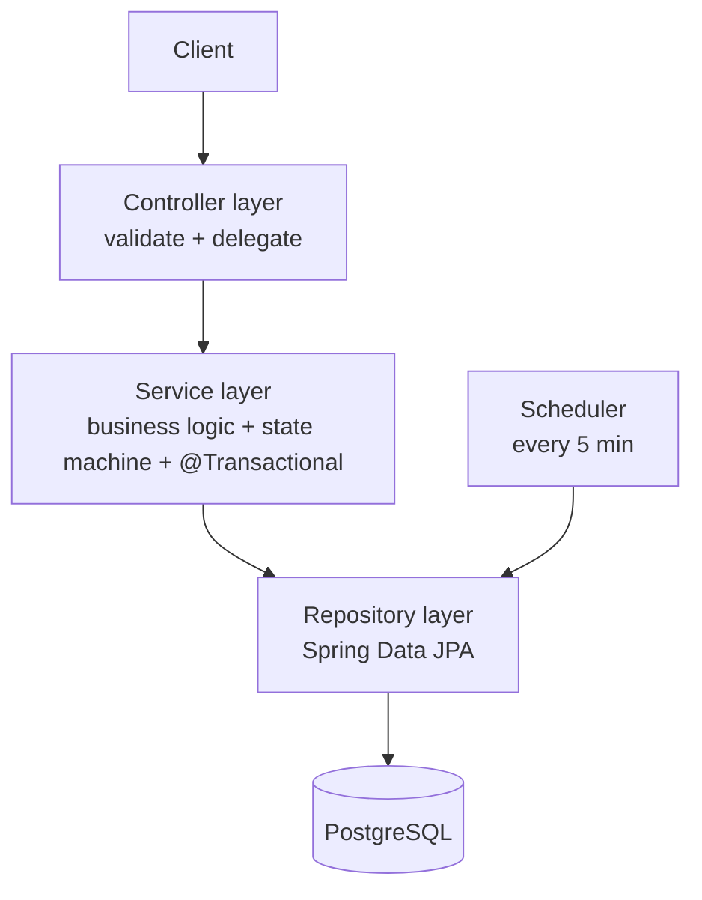
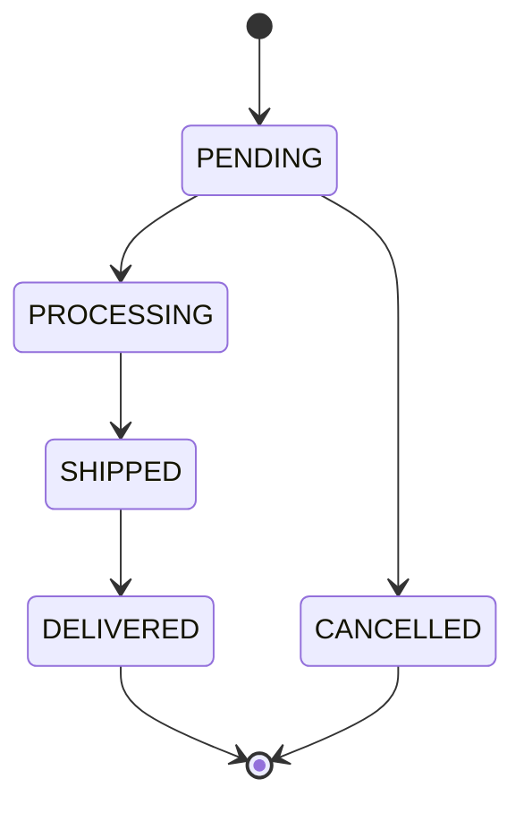

# Order Processing System

A backend for an e-commerce order processing system, built as a layered Spring Boot monolith. It exposes five REST operations, enforces an order **state machine**, runs a scheduled background job, and is covered by unit, integration, and concurrency tests against a real PostgreSQL.

It's a straightforward controller → service → repository layout. The part that needed the most thought is the **cancel vs. background-job race**, which is handled with a single atomic conditional update.

---

## Table of contents

- [Quick start](#quick-start)
- [Running tests](#running-tests)
- [API overview](#api-overview)
- [Architecture](#architecture)
- [Domain model & schema](#domain-model--schema)
- [Order state machine](#order-state-machine)
- [Key design decisions (with trade-offs)](#key-design-decisions-with-trade-offs)
- [The cancel vs. background-job race](#the-cancel-vs-background-job-race)
- [Scope: in vs out](#scope-in-vs-out)
- [Troubleshooting](#troubleshooting)
- [AI usage](#ai-usage)

---

## Quick start

**Prerequisites:** Docker + Docker Compose. Nothing else — the build runs inside the image.

```bash
docker compose up --build
```

This starts PostgreSQL and the application. Once healthy:

- API base: `http://localhost:8080/api/v1/orders`
- Swagger UI: `http://localhost:8080/swagger-ui.html`
- OpenAPI JSON: `http://localhost:8080/v3/api-docs`
- Health: `http://localhost:8080/actuator/health`

To stop and remove everything (including the database volume):

```bash
docker compose down -v
```

### Running locally without Docker (optional)

You need a PostgreSQL reachable at the configured URL. Defaults are `jdbc:postgresql://localhost:5432/orders` with user/password `orders`/`orders` (override via `SPRING_DATASOURCE_*` env vars, see `.env.example`).

```bash
./mvnw spring-boot:run
```

Flyway creates the schema automatically on startup.

---

## Running tests

```bash
./mvnw test
```

The integration and concurrency tests use **Testcontainers**, which starts a throwaway PostgreSQL 16 container automatically — so you need a running Docker daemon, but you do **not** need to start a database yourself. There are three layers:

| Layer | What it proves |
|---|---|
| **Unit** (`OrderStateMachineTest`) | Every legal transition is allowed and every illegal one is rejected — no Spring context, microseconds to run. |
| **Integration** (`OrderApiIntegrationTest`, `OrderPromotionSchedulerIntegrationTest`) | The endpoints, validation, pagination, error codes, persistence, and the scheduled job, all against real SQL and real constraints. |
| **Concurrency** (`CancelVsPromoteConcurrencyTest`) | Cancel and the promotion job race on the same order from two threads across 40 iterations; exactly one wins and the row is never corrupted. This test **fails** against the naive read-then-write implementation. |

### Manual end-to-end testing

For a copy-paste, run-it-by-hand walkthrough of every feature (create, retrieve, list, status updates, the background job, cancel, idempotency, plus direct DB verification), follow **[`docs/TESTING.md`](./docs/TESTING.md)**. Prefer Postman? Import the ready-to-run collection in **[`docs/postman/`](./docs/postman/README.md)**.

---

## API overview

| Operation | Method & path | Notes | Codes |
|---|---|---|---|
| Create | `POST /api/v1/orders` | ≥1 item, quantities > 0; order + items persisted in one transaction. Honors an optional `Idempotency-Key` header. | `201` / `400` |
| Retrieve | `GET /api/v1/orders/{id}` | Returns the order with its items **and status history**. | `200` / `404` |
| List | `GET /api/v1/orders?status=PENDING&page=0&size=20` | Optional status filter; **paginated** (max page size 100). | `200` |
| Update status | `PATCH /api/v1/orders/{id}/status` | Validated against the state machine. | `200` / `404` / `409` |
| Cancel | `POST /api/v1/orders/{id}/cancel` | Allowed only from `PENDING`; atomic. | `200` / `404` / `409` |

> **Per-endpoint deep dives:** see [`docs/api/`](./docs/api/README.md) for an end-to-end walkthrough of each API — request, validation, the full controller → service → repository → DB flow with code, responses, and the tests that cover it.

### Example session

```bash
# Create an order
curl -s -X POST http://localhost:8080/api/v1/orders \
  -H 'Content-Type: application/json' \
  -d '{
    "customerId": "11111111-1111-1111-1111-111111111111",
    "items": [
      {"productId": "22222222-2222-2222-2222-222222222222", "quantity": 2, "unitPrice": "19.99"},
      {"productId": "33333333-3333-3333-3333-333333333333", "quantity": 1, "unitPrice": "5.00"}
    ]
  }'

# Retrieve it (use the id returned above)
curl -s http://localhost:8080/api/v1/orders/<ID>

# List PENDING orders, paginated
curl -s 'http://localhost:8080/api/v1/orders?status=PENDING&page=0&size=20'

# Advance the status (PENDING -> PROCESSING)
curl -s -X PATCH http://localhost:8080/api/v1/orders/<ID>/status \
  -H 'Content-Type: application/json' -d '{"status":"PROCESSING"}'

# Cancel (only works while PENDING; returns 409 otherwise)
curl -s -X POST http://localhost:8080/api/v1/orders/<ID>/cancel
```

All errors share one shape:

```json
{
  "timestamp": "2026-06-19T09:30:00Z",
  "status": 409,
  "error": "Conflict",
  "message": "Illegal status transition: SHIPPED -> CANCELLED",
  "path": "/api/v1/orders/.../status",
  "fieldErrors": null
}
```

---

## Architecture

A layered monolith — each layer has a single job:



```
com.peerislands.orders
├── controller   REST endpoints (thin: validate + delegate)
├── service      business logic, state machine, @Transactional
├── repository   Spring Data JPA interfaces
├── domain       entities + OrderStatus enum
├── dto          request/response records
├── exception    custom exceptions + @RestControllerAdvice
├── scheduler    the 5-minute background job
└── config       OpenAPI config
```

Controllers stay thin, all business rules live in the service, and JPA entities are never exposed — everything maps to DTO **records**. Dependencies are wired by **constructor injection** throughout.

### Tech stack

Java 17 · Spring Boot 3 · PostgreSQL 16 · Flyway (versioned migrations) · Spring Data JPA · Bean Validation · Spring `@Scheduled` · springdoc-openapi · JUnit 5 + Testcontainers · Docker / Docker Compose.

---

## Domain model & schema

The schema is owned by **Flyway** (`src/main/resources/db/migration/V1__init.sql`), not Hibernate `ddl-auto` (which is set to `validate` so the app fails fast if entities and schema drift apart).

- `orders` — id, customer_id, status, total_amount, **version** (optimistic lock), timestamps
- `order_items` — line items, `CHECK (quantity > 0)`, `ON DELETE CASCADE`
- `order_status_history` — append-only audit trail of status changes
- `idempotency_keys` — maps an `Idempotency-Key` to the order it created (`UNIQUE`)

---

## Order state machine



The legal transitions live in **one place** — `OrderStateMachine.ALLOWED` — and everything else is rejected with `409 Conflict`. You cannot cancel a `SHIPPED` order, move `DELIVERED` backwards, or skip straight to `SHIPPED`. Adding a status or a transition is a one-line change to that map.

---

## Key design decisions (with trade-offs)

- **UUID primary keys, not auto-increment.** Sequential ids let anyone enumerate orders and infer volume; UUIDs close that. Trade-off: slightly larger indexes — negligible at this scale.
- **`version` column / optimistic locking.** Protects concurrent updates without holding database locks. It's the second layer of safety behind the conditional update (below).
- **`order_status_history` table.** The requirement is to *track* status, so a single mutable column isn't enough — the history table is a real audit trail. Cheap to add. (API-driven transitions write history; the bulk scheduler promotion is logged with a count rather than writing per-row history, to keep it a single set-based statement — see [Scope](#scope-in-vs-out).)
- **Cancel is `POST /{id}/cancel`, not `DELETE`.** The order *transitions* to `CANCELLED`; it is not deleted, so reporting and history survive.
- **The list endpoint is paginated** with sensible defaults (`size=20`, capped at `100`). Returning every row unbounded is a classic red flag even when the requirement says "all".
- **Flyway over `ddl-auto`.** The database is treated as a managed, versioned asset.
- **Testcontainers over mocked repositories.** Integration tests exercise real SQL, real constraints, and real transaction behavior. Mocking the repository would prove nothing about the actual database.
- **Idempotent create.** A retried or double-clicked `POST /orders` with the same `Idempotency-Key` returns the existing order instead of creating a duplicate.

---

## The cancel vs. background-job race

A customer hits **cancel** at the same instant the scheduler promotes that order to `PROCESSING`. The naive implementation reads then writes:

```java
// WRONG: read-then-write race with the scheduler
Order o = repo.findById(id).orElseThrow();
if (o.getStatus() == PENDING) {
    o.setStatus(CANCELLED);
    repo.save(o);          // the job may have flipped it to PROCESSING in between
}
```

This service uses a single **atomic conditional update** instead, so the check-and-set happens in the database:

```java
@Modifying
@Query("UPDATE Order o SET o.status = CANCELLED, o.version = o.version + 1 " +
       "WHERE o.id = :id AND o.status = PENDING")
int cancelIfPending(UUID id);
```

If it updates `0` rows, the order is no longer `PENDING` (already promoted or cancelled) and the API returns `409`. The `WHERE status = PENDING` clause makes it correct without explicit locks; the `version` bump is the optimistic-locking second layer. `CancelVsPromoteConcurrencyTest` fires both operations from two threads over 40 iterations and asserts exactly one wins — it fails against the read-then-write version.

The scheduled promotion is likewise a single set-based statement, not a loop:

```java
// UPDATE orders SET status = 'PROCESSING' WHERE status = 'PENDING'
int promoted = repo.promotePending();
```

> **Production note (named, not built):** running this `@Scheduled` job on two app instances would fire it twice per tick. The fix is **ShedLock** (a distributed lock backed by Postgres/Redis) so exactly one instance runs each tick. Not wired here because the submission runs a single instance.

---

## Scope: in vs out

**In scope:** the five operations, the state machine, the scheduled promotion job, validation, consistent error handling, idempotent create, OpenAPI docs, Docker one-command run, and unit/integration/concurrency tests.

**Out of scope — deliberately, and why:**

- **Payment processing.** Not in the requirements; orders carry a `total_amount` and move through statuses, nothing charges a card. If extended, duplicate charges would be prevented in layers: a `payments` table with `UNIQUE(order_id)`, a conditional state transition so only one thread initiates, an idempotency key passed to the payment provider, and idempotent webhook handling with reconciliation. You can't get exactly-once over a network, so the realistic goal is *at-most-once* charging with the provider as source of truth.
- **Authentication / customer isolation.** Not specified. The natural design is JWT bearer tokens plus an ownership check (an IDOR guard) so customer A can't read or cancel customer B's order.
- **Microservices / Kafka / event sourcing.** At scale, publish an `OrderPlaced` event via a transactional outbox to decouple inventory, notifications, and fulfillment. None of it is built here — it would be over-engineering for this scope.
- **Per-row history for the bulk promotion job.** Kept as a single set-based statement + count log; per-row audit for the bulk job could be added with an `INSERT … SELECT` if required.

---

## Troubleshooting

**`./mvnw test` fails with `client version 1.32 is too old. Minimum supported API version is 1.40`.**
Newer Docker daemons (Docker 29 raised the minimum Engine API to 1.40) reject the API version that Testcontainers' bundled docker-java client defaults to. This project pins a compatible version via the `docker.api.version` property (default `1.41`) in `pom.xml`, wired into the test JVM. If your daemon needs a different version, override it:

```bash
./mvnw test -Ddocker.api.version=1.44
```

**Testcontainers can't find Docker.** Ensure the Docker daemon is running (`docker ps`). On Docker Desktop for macOS, `DOCKER_HOST` is usually auto-detected via `/var/run/docker.sock`.

---

## AI usage

See **[`AI_USAGE.md`](./AI_USAGE.md)** for a candid account of where an AI assistant was used, the bugs it introduced (notably the read-then-write cancel race and an unbounded list endpoint), and how they were caught and corrected.
