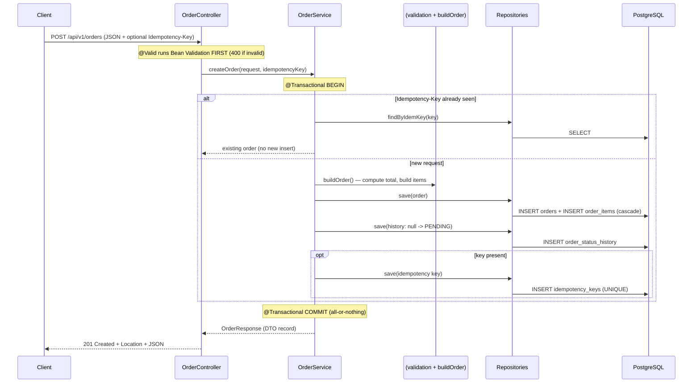

# Create Order (POST) — explained end to end

> One self-contained page. Everything you need to explain `POST /api/v1/orders` in the interview is here — the full code path, every annotation, why each choice was made, and the design patterns involved. You should not need to open any other file.

---

## 0. What this API does (in one paragraph)

`POST /api/v1/orders` lets a customer place an order containing one or more line items. In a single database transaction it: validates the request, computes the total on the server, inserts the order plus all its items, writes the first status-history row (`PENDING`), and — if the client sent an `Idempotency-Key` — records that key so a retry doesn't create a duplicate. It returns `201 Created` with the full order, or `400 Bad Request` if the body is invalid.

| | |
|---|---|
| **Method & path** | `POST /api/v1/orders` |
| **Request body** | `customerId` + a non-empty list of `items` |
| **Optional header** | `Idempotency-Key: <any unique string>` |
| **Success** | `201 Created` + `Location` header + order JSON |
| **Failure** | `400 Bad Request` (validation) |

---

## 1. The request

### Example HTTP call

```bash
curl -i -X POST http://localhost:8080/api/v1/orders \
  -H 'Content-Type: application/json' \
  -H 'Idempotency-Key: 7f3c1a90-0000-0000-0000-000000000001' \
  -d '{
    "customerId": "11111111-1111-1111-1111-111111111111",
    "items": [
      { "productId": "22222222-2222-2222-2222-222222222222", "quantity": 2, "unitPrice": "19.99" },
      { "productId": "33333333-3333-3333-3333-333333333333", "quantity": 1, "unitPrice": "5.00" }
    ]
  }'
```

The `Idempotency-Key` header is optional — leave it out and it behaves like a normal create.

---

## 2. The journey of one request (the big picture)



The whole thing crosses **three layers** — controller, service, repository — and touches **four tables**. The next sections walk each layer line by line.

---

## 3. Layer 1 — The Controller (speak HTTP, then delegate)

This is the entry point. Its only jobs are: accept the HTTP request, let validation run, hand off to the service, and shape the HTTP response. **No business logic lives here.**

```java
@RestController
@RequestMapping("/api/v1/orders")
@Tag(name = "Orders", description = "Create, retrieve, list, update status, and cancel orders")
public class OrderController {

    private final OrderService orderService;

    public OrderController(OrderService orderService) {   // constructor injection
        this.orderService = orderService;
    }

    @PostMapping
    @Operation(summary = "Create an order with one or more items")
    public ResponseEntity<OrderResponse> create(
            @Valid @RequestBody CreateOrderRequest request,
            @RequestHeader(value = "Idempotency-Key", required = false) String idempotencyKey,
            UriComponentsBuilder uriBuilder) {
        OrderResponse created = orderService.createOrder(request, idempotencyKey);
        URI location = uriBuilder.path("/api/v1/orders/{id}").buildAndExpand(created.id()).toUri();
        return ResponseEntity.created(location).body(created);
    }
}
```

### Every annotation, explained

| Annotation | What it does | Why it matters |
|---|---|---|
| `@RestController` | `@Controller` + `@ResponseBody`; return values are serialized straight to JSON | No need to annotate each method's body; it's a REST API, not a view renderer |
| `@RequestMapping("/api/v1/orders")` | Base path for every method in the class | `/v1` is API **versioning** — I can ship `/v2` later without breaking existing clients |
| `@PostMapping` | Maps HTTP `POST` on the base path to this method | POST = "create a new resource," the correct verb for creating an order |
| `@Valid` | Triggers Bean Validation on the request body **before the method body runs** | Bad input is rejected at the edge; the service never sees invalid data |
| `@RequestBody` | Deserializes the JSON body into a `CreateOrderRequest` (via Jackson) | Turns the wire format into a typed Java object |
| `@RequestHeader(... required = false)` | Reads the optional `Idempotency-Key` header; `null` if absent | Makes idempotency **opt-in** — normal clients don't have to send it |
| `@Operation` / `@Tag` | springdoc-openapi metadata for Swagger UI | Auto-generated API docs, cheap and high-signal |

### Why constructor injection (not `@Autowired` on a field)?

```java
private final OrderService orderService;
public OrderController(OrderService orderService) { this.orderService = orderService; }
```

- The dependency is `final` → set once, never null, immutable.
- The object can't be constructed in a half-wired state.
- In a unit test I can `new OrderController(mockService)` — no Spring, no reflection.

Field injection (`@Autowired` on a private field) hides dependencies and needs reflection to set in tests. Constructor injection is the recommended style.

### Why `ResponseEntity.created(location)` and not just return the body?

`POST` that creates a resource should return **`201 Created`** (not `200 OK`) and a **`Location` header** pointing at the new resource's URL:

```
HTTP/1.1 201 Created
Location: /api/v1/orders/48a214d9-1045-4b27-84ca-5501de5e2aab
```

That's the RESTful contract for creation — the client learns where the new thing lives. `uriBuilder.path(...).buildAndExpand(created.id())` builds that URL from the new order's id.

---

## 4. The request DTOs (and validation)

The body deserializes into these two **records**. The validation rules live *on the data itself*.

```java
public record CreateOrderRequest(
        @NotNull(message = "customerId is required")
        UUID customerId,

        @NotEmpty(message = "an order must contain at least one item")
        @Valid                                  // cascade validation INTO each item
        List<CreateOrderItemRequest> items
) {}

public record CreateOrderItemRequest(
        @NotNull(message = "productId is required")
        UUID productId,

        @NotNull(message = "quantity is required")
        @Positive(message = "quantity must be greater than 0")
        Integer quantity,

        @NotNull(message = "unitPrice is required")
        @DecimalMin(value = "0.00", message = "unitPrice must not be negative")
        @Digits(integer = 10, fraction = 2, message = "unitPrice must have at most 2 decimal places")
        BigDecimal unitPrice
) {}
```

### Why records?

A `record` is an immutable data carrier: no boilerplate getters/setters, value-based `equals`/`hashCode`, and Jackson constructs it via its canonical constructor. A DTO is *data, not behaviour* — exactly what a record is for.

### Every constraint, explained

| Field | Constraint | Meaning |
|---|---|---|
| `customerId` | `@NotNull` | must be present |
| `items` | `@NotEmpty` | not null **and** at least one item (an order with zero items is meaningless) |
| `items` | `@Valid` | **cascade** — also validate each item in the list (without this, the item rules below wouldn't run) |
| `quantity` | `@Positive` | must be > 0 (you can't order 0 or -1 of something) |
| `unitPrice` | `@DecimalMin("0.00")` | not negative |
| `unitPrice` | `@Digits(integer=10, fraction=2)` | at most 2 decimal places — it's money |

### The `@Valid` cascade gotcha (worth mentioning live)

`@NotEmpty` on the list only checks the list itself. To validate each *element*, you need `@Valid` on the list too. Forgetting this is a common bug — the item-level rules silently never fire.

### `@NotNull` vs `@NotEmpty` vs `@NotBlank`

- `@NotNull` — not null (but an empty list/string is allowed).
- `@NotEmpty` — not null **and** size ≥ 1 (used for `items`).
- `@NotBlank` — for strings: not null and not just whitespace.

### What happens when validation fails

`@Valid` failing throws `MethodArgumentNotValidException` **before** the controller body runs. A global handler (`@RestControllerAdvice`) turns it into a structured `400`:

```json
{
  "timestamp": "2026-06-19T09:30:00Z",
  "status": 400,
  "error": "Bad Request",
  "message": "Validation failed",
  "path": "/api/v1/orders",
  "fieldErrors": [
    { "field": "items", "message": "an order must contain at least one item" }
  ]
}
```

**Key principle: validation = "is the request well-formed?" (→ 400).** That's different from business rules like "can this status change?" (→ 409). They're kept separate on purpose.

---

## 5. Layer 2 — The Service (the brain: rules + transaction)

This is where the real work happens. Read it once, then we'll dissect it.

```java
@Service
public class OrderService {

    private final OrderRepository orderRepository;
    private final OrderStatusHistoryRepository historyRepository;
    private final IdempotencyKeyRepository idempotencyKeyRepository;
    private final OrderStateMachine stateMachine;

    public OrderService(OrderRepository orderRepository,
                        OrderStatusHistoryRepository historyRepository,
                        IdempotencyKeyRepository idempotencyKeyRepository,
                        OrderStateMachine stateMachine) {
        this.orderRepository = orderRepository;
        this.historyRepository = historyRepository;
        this.idempotencyKeyRepository = idempotencyKeyRepository;
        this.stateMachine = stateMachine;
    }

    @Transactional
    public OrderResponse createOrder(CreateOrderRequest request, String idempotencyKey) {
        boolean hasKey = StringUtils.hasText(idempotencyKey);

        // (A) Idempotency fast-path: have we already processed this key?
        if (hasKey) {
            Optional<IdempotencyKey> existing = idempotencyKeyRepository.findByIdemKey(idempotencyKey);
            if (existing.isPresent()) {
                return detailById(existing.get().getOrderId());   // return original, create nothing
            }
        }

        // (B) Build the domain object (total computed server-side)
        Order order = buildOrder(request);

        try {
            orderRepository.save(order);                          // INSERT order + cascade items
            recordHistory(order.getId(), null, OrderStatus.PENDING);
            if (hasKey) {
                idempotencyKeyRepository.save(new IdempotencyKey(UUID.randomUUID(), idempotencyKey, order.getId()));
            }
        } catch (DataIntegrityViolationException e) {
            // (C) Two identical requests raced on the same key; one lost the UNIQUE constraint.
            if (hasKey) {
                return idempotencyKeyRepository.findByIdemKey(idempotencyKey)
                        .map(k -> detailById(k.getOrderId()))
                        .orElseThrow(() -> e);
            }
            throw e;
        }

        return detailById(order.getId());
    }

    private Order buildOrder(CreateOrderRequest request) {
        BigDecimal total = request.items().stream()
                .map(i -> i.unitPrice().multiply(BigDecimal.valueOf(i.quantity())))
                .reduce(BigDecimal.ZERO, BigDecimal::add);
        Order order = new Order(UUID.randomUUID(), request.customerId(), OrderStatus.PENDING, total);
        for (var itemReq : request.items()) {
            order.addItem(new OrderItem(UUID.randomUUID(), itemReq.productId(), itemReq.quantity(), itemReq.unitPrice()));
        }
        return order;
    }

    private void recordHistory(UUID orderId, OrderStatus from, OrderStatus to) {
        historyRepository.save(new OrderStatusHistory(UUID.randomUUID(), orderId, from, to));
    }

    private OrderResponse detailById(UUID id) {
        Order order = orderRepository.findByIdWithItems(id).orElseThrow(() -> new OrderNotFoundException(id));
        List<OrderStatusHistory> history = historyRepository.findByOrderIdOrderByChangedAtAsc(id);
        return OrderResponse.detail(order, history);
    }
}
```

### 5.1 `@Transactional` — the all-or-nothing guarantee

```java
@Transactional
public OrderResponse createOrder(...) { ... }
```

This method writes to **three tables**: `orders`, `order_items`, `order_status_history` (and `idempotency_keys` if a key is present). `@Transactional` makes them **one atomic unit**:

- Spring wraps the method in a proxy: on entry it opens a DB transaction (`BEGIN`); on normal return it `COMMIT`s; if a `RuntimeException` escapes, it `ROLLBACK`s.
- So you can **never** end up with an order that has no items, or an order without its creation-history row. Either everything lands, or nothing does.
- This is the **A** (atomicity) in ACID, and it's the single most important reason this logic is in the service, not the controller.

### 5.2 Why the total is computed on the server

```java
BigDecimal total = request.items().stream()
        .map(i -> i.unitPrice().multiply(BigDecimal.valueOf(i.quantity())))
        .reduce(BigDecimal.ZERO, BigDecimal::add);
```

The client sends item prices and quantities, but **the server computes the total** — it never trusts a client-supplied total. (A malicious client could otherwise send a $0 total.) Two details:

- **`BigDecimal`, not `double`:** floating point can't represent decimal money exactly (`0.1 + 0.2 != 0.3`), which corrupts currency math. `BigDecimal` is exact.
- The total = Σ (unitPrice × quantity) for `[2 × 19.99, 1 × 5.00]` = `39.98 + 5.00 = 44.98`.

### 5.3 Server-generated UUIDs and the starting status

```java
Order order = new Order(UUID.randomUUID(), request.customerId(), OrderStatus.PENDING, total);
```

- The **id is generated server-side** (`UUID.randomUUID()`), so we know it before insert (handy for the `Location` header) and clients can't pick ids.
- Every new order starts in **`PENDING`** — the entry state of the lifecycle.

### 5.4 `addItem(...)` — keeping the object graph consistent

```java
order.addItem(new OrderItem(UUID.randomUUID(), itemReq.productId(), itemReq.quantity(), itemReq.unitPrice()));
```

`addItem` (on the `Order` entity) sets **both** sides of the relationship: it points the item back at the order (the foreign key) and adds it to the order's list. We'll see why in the entity section.

### 5.5 One `save` writes two tables (cascade)

```java
orderRepository.save(order);   // inserts the order AND all its items
```

Because the `Order` entity declares `cascade = CascadeType.ALL` on its items, saving the order cascades the insert to every `OrderItem`. One call → two tables, all inside the same transaction.

### 5.6 Writing the audit trail

```java
recordHistory(order.getId(), null, OrderStatus.PENDING);
```

Right after creating the order we record its first history row: `from = null → to = PENDING`. This gives every order an audit trail from birth, in the `order_status_history` table. (The requirement says "track their status" — a history table answers "how did it get here," not just "where is it now.")

### 5.7 Idempotency — why it exists and how it works (the subtle part)

**The problem:** `POST` is *not* idempotent — each call creates a new resource. If the client double-clicks, or the response is lost and the client auto-retries, the server naively makes **two orders**. The client can't safely retry on its own because it doesn't know if the first attempt succeeded.

**The fix:** the client sends a unique `Idempotency-Key`; the server remembers "key K → order O" and returns O on a repeat instead of creating a new order.

Three scenarios, all handled by the code above:

**Scenario 1 — first request (key never seen):** block (A) finds nothing → build + save the order → store `(key → orderId)` in `idempotency_keys`. Returns the new order.

**Scenario 2 — retry with the same key:** block (A) finds the key → returns the **original** order immediately. No second order. ✅

**Scenario 3 — two identical requests at the exact same instant (the tricky one):** both pass block (A) before either commits (neither sees the key yet) → both try to insert. The `idem_key` column has a **`UNIQUE` constraint**, so only **one** insert succeeds; the other's commit violates it and throws `DataIntegrityViolationException`. Block (C) catches that, re-reads the key (now committed by the winner), and returns the **winner's** order.

> **The key insight for the interview:** the check in block (A) is just an optimization. The thing that actually *guarantees* one-order-per-key — even under simultaneous requests — is the database **`UNIQUE` constraint**, not the application code. This is the same philosophy as the cancel race: push correctness into the database.

If no key is sent (`hasKey == false`), all of this is skipped and create behaves like a plain POST.

### 5.8 Mapping back to a DTO (entities never leak out)

```java
private OrderResponse detailById(UUID id) {
    Order order = orderRepository.findByIdWithItems(id).orElseThrow(() -> new OrderNotFoundException(id));
    List<OrderStatusHistory> history = historyRepository.findByOrderIdOrderByChangedAtAsc(id);
    return OrderResponse.detail(order, history);
}
```

Before returning, the service converts the JPA `Order` entity into an `OrderResponse` **record**. The controller serializes that record to JSON; the client never sees the entity. Why this matters:

1. **Decoupling** — a database column rename doesn't become a breaking API change.
2. **No `LazyInitializationException`** — the mapping happens *inside* the transaction, so lazy associations (items) are loaded safely while the session is open.
3. **No leaking internals** — fields like the optimistic-lock `version` column stay out of the API.

Note `findByIdWithItems` uses a `JOIN FETCH` to load the order and its items in **one** query (avoiding the N+1 problem), and history is loaded ordered by time.

---

## 6. Layer 3 — The Repositories (talk to the database)

The service never writes SQL or JDBC. It calls **repository interfaces**, and Spring Data generates the implementation at runtime.

```java
public interface OrderRepository extends JpaRepository<Order, UUID> {
    @Query("SELECT o FROM Order o LEFT JOIN FETCH o.items WHERE o.id = :id")
    Optional<Order> findByIdWithItems(@Param("id") UUID id);
    // ... (other methods used by other endpoints)
}

public interface OrderStatusHistoryRepository extends JpaRepository<OrderStatusHistory, UUID> {
    List<OrderStatusHistory> findByOrderIdOrderByChangedAtAsc(UUID orderId);
}

public interface IdempotencyKeyRepository extends JpaRepository<IdempotencyKey, UUID> {
    Optional<IdempotencyKey> findByIdemKey(String idemKey);
}
```

What's happening:

- **`JpaRepository<Order, UUID>`** gives `save`, `findById`, `findAll`, etc. for free — no implementation written.
- **Derived queries:** `findByIdemKey` and `findByOrderIdOrderByChangedAtAsc` are generated from the *method name* — Spring parses the name and writes the SQL. I never wrote an `Impl` class.
- **`findByIdWithItems`** is a custom JPQL query with `LEFT JOIN FETCH` so the order + items come back in one SQL statement (no N+1).
- All queries are **parameterized** (`:id`, etc.), which kills SQL injection for free.

This is the **Repository pattern**: the service says "save this," "find this," and is completely insulated from *how* persistence works.

---

## 7. The entities and the schema (where the data lands)

### The `Order` entity (annotated)

```java
@Entity
@Table(name = "orders")
public class Order {

    @Id
    private UUID id;                                  // app-assigned UUID

    @Column(name = "customer_id", nullable = false)
    private UUID customerId;

    @Enumerated(EnumType.STRING)                      // store "PENDING", not 0/1
    @Column(nullable = false, length = 20)
    private OrderStatus status;

    @Column(name = "total_amount", precision = 12, scale = 2)
    private BigDecimal totalAmount;                   // money = BigDecimal

    @Version                                          // optimistic lock
    private long version;

    @CreationTimestamp  private OffsetDateTime createdAt;   // set by Hibernate on insert
    @UpdateTimestamp    private OffsetDateTime updatedAt;    // set by Hibernate on update

    @OneToMany(mappedBy = "order", cascade = CascadeType.ALL, orphanRemoval = true, fetch = FetchType.LAZY)
    private List<OrderItem> items = new ArrayList<>();

    protected Order() { }                             // no-arg ctor required by JPA

    public Order(UUID id, UUID customerId, OrderStatus status, BigDecimal totalAmount) { ... }

    public void addItem(OrderItem item) {
        item.setOrder(this);     // set the owning (foreign-key) side
        this.items.add(item);    // and the inverse collection
    }
}
```

Key annotations and *why*:

| Annotation | Why |
|---|---|
| `@Entity` / `@Table` | Maps the class to the `orders` table |
| `@Id` (app-assigned UUID) | No sequential ids → can't enumerate orders / infer volume; id known before insert |
| `@Enumerated(EnumType.STRING)` | Persist the status name (`"PENDING"`), not its ordinal int — reordering the enum later won't corrupt data |
| `@Version` | Optimistic-locking token; protects against concurrent updates (used by other endpoints) |
| `@CreationTimestamp` / `@UpdateTimestamp` | Hibernate fills these automatically |
| `@OneToMany(cascade = ALL, orphanRemoval = true)` | Saving the order saves its items; removing an item deletes its row |
| `protected Order()` | JPA instantiates entities via reflection and needs a no-arg constructor; `protected` signals "framework only" |

### Why `addItem` sets both sides

In a bidirectional relationship, the `OrderItem` owns the foreign key (`@ManyToOne @JoinColumn(order_id)`), and `Order.items` is the inverse side. You must set **both** in memory or the saved data and the in-memory graph disagree. `addItem` centralizes that so callers can't forget.

### The schema (Flyway-owned)

The tables are created by a versioned Flyway migration (`V1__init.sql`), not by Hibernate:

```sql
CREATE TABLE orders (
    id           UUID PRIMARY KEY,
    customer_id  UUID NOT NULL,
    status       VARCHAR(20) NOT NULL,
    total_amount NUMERIC(12,2) NOT NULL,
    version      BIGINT NOT NULL DEFAULT 0,          -- optimistic locking
    created_at   TIMESTAMPTZ NOT NULL DEFAULT now(),
    updated_at   TIMESTAMPTZ NOT NULL DEFAULT now()
);

CREATE TABLE order_items (
    id         UUID PRIMARY KEY,
    order_id   UUID NOT NULL REFERENCES orders(id) ON DELETE CASCADE,
    product_id UUID NOT NULL,
    quantity   INT NOT NULL CHECK (quantity > 0),     -- DB enforces it too
    unit_price NUMERIC(12,2) NOT NULL
);

CREATE TABLE order_status_history (
    id          UUID PRIMARY KEY,
    order_id    UUID NOT NULL REFERENCES orders(id) ON DELETE CASCADE,
    from_status VARCHAR(20),
    to_status   VARCHAR(20) NOT NULL,
    changed_at  TIMESTAMPTZ NOT NULL DEFAULT now()
);

CREATE TABLE idempotency_keys (
    id        UUID PRIMARY KEY,
    idem_key  VARCHAR(255) NOT NULL UNIQUE,           -- the dedup guarantee
    order_id  UUID NOT NULL REFERENCES orders(id) ON DELETE CASCADE,
    created_at TIMESTAMPTZ NOT NULL DEFAULT now()
);
```

Notice the database enforces the same rules as the app, as a backstop: `CHECK (quantity > 0)` mirrors `@Positive`, and `UNIQUE (idem_key)` is what makes idempotency correct under concurrency. **Defense in layers** — the app validates for a friendly error, the DB enforces for a hard guarantee.

> **Why Flyway, not `ddl-auto`?** The schema is a versioned, reviewable asset. `spring.jpa.hibernate.ddl-auto=validate` only *checks* that the entities match the migrated schema and fails fast on drift — Hibernate never silently alters the database. Auto-DDL is unpredictable and unsafe in production.

---

## 8. The response

On success the service returns an `OrderResponse` (a record), serialized to JSON as `201 Created`:

```json
{
  "id": "48a214d9-1045-4b27-84ca-5501de5e2aab",
  "customerId": "11111111-1111-1111-1111-111111111111",
  "status": "PENDING",
  "totalAmount": 44.98,
  "createdAt": "2026-06-19T04:04:40.370795Z",
  "updatedAt": "2026-06-19T04:04:40.370855Z",
  "items": [
    { "id": "f058d4eb-...", "productId": "22222222-...", "quantity": 2, "unitPrice": 19.99, "lineTotal": 39.98 },
    { "id": "00bda5dc-...", "productId": "33333333-...", "quantity": 1, "unitPrice": 5.00,  "lineTotal": 5.00 }
  ],
  "history": [
    { "fromStatus": null, "toStatus": "PENDING", "changedAt": "2026-06-19T04:04:40.376726Z" }
  ]
}
```

The `OrderResponse.detail(...)` factory builds it from the entity + history, and `lineTotal` (quantity × unitPrice) is computed in `OrderItemResponse.from(...)`. The total of `44.98` and the single `PENDING` history row are the proof the whole flow worked.

---

## 9. Design patterns in this one API (with the line that proves each)

This is the "what patterns did you use here?" answer, scoped to just create-order.

| # | Pattern | Where, in this flow | Why it's used |
|---|---|---|---|
| 1 | **Layered architecture** | controller → service → repository | Separation of concerns: HTTP, business rules, persistence each isolated and testable |
| 2 | **DTO (Data Transfer Object)** | `CreateOrderRequest` in, `OrderResponse` out | Decouple the API from the entity; no lazy-load leaks; hide internals like `version` |
| 3 | **Dependency Injection / IoC** | constructor injection in `OrderController` & `OrderService` | Loose coupling, `final` deps, trivially testable without Spring |
| 4 | **Repository pattern** | `OrderRepository`, `IdempotencyKeyRepository`, … | Service is insulated from SQL/JDBC; parameterized queries kill injection |
| 5 | **Unit of Work / Transaction Script** | `@Transactional` on `createOrder` | The 3–4 inserts commit or roll back together (atomicity) |
| 6 | **Idempotency key** | `Idempotency-Key` header + `idempotency_keys` UNIQUE table | Make `POST` safe to retry — same key returns the original order |
| 7 | **Optimistic locking** | `@Version` on `Order` (set up here, exercised on updates) | Detect concurrent modification without holding DB locks |
| 8 | **Factory method (mapping)** | `OrderResponse.detail(...)`, `OrderItemResponse.from(...)` | Centralize entity→DTO construction in one place |
| 9 | **Audit log / append-only history** | `recordHistory(null → PENDING)` | Track *how* status changed over time, not just the current value |
| 10 | **Declarative validation** | Bean Validation annotations + `@Valid` | Reject malformed input at the edge, declaratively, not with hand-written `if`s |
| 11 | **Centralized error handling** | `@RestControllerAdvice` turns failures into one error shape | Controllers stay clean; every error looks the same |

And what we **didn't** add (scope judgment): no event publishing/Kafka on create, no CQRS, no generic mapper framework — explicit factory methods are clearer at this size.

---

## 10. Why POST (and not something else)?

- **`POST`, not `PUT`:** `PUT` is for creating/replacing a resource *at a client-known URL* and is idempotent by definition. Here the **server** decides the new order's id (a UUID), so `POST` to the collection (`/orders`) is correct — the server creates the resource and tells you where it is via the `Location` header.
- **`POST`, not `GET`:** create has side effects (it writes data); `GET` must be safe/read-only.
- **`201 Created`, not `200 OK`:** signals a new resource was created and pairs with the `Location` header.

---

## 11. The 90-second verbal walkthrough (say this)

> A client POSTs a customer id and a list of items. `@Valid` runs Bean Validation first — empty items or a non-positive quantity is a 400 before any logic runs. The controller is thin: it just delegates to the service. `createOrder` is `@Transactional`, so everything inside is atomic. If an `Idempotency-Key` was sent and already seen, I return the original order and create nothing — that makes POST safe to retry. Otherwise I build the order, computing the total server-side with `BigDecimal` so money is exact, generate a UUID id, and start it in PENDING. One `save` inserts the order and cascades the items, then I write the first history row. If two identical keyed requests race, the UNIQUE constraint on the key lets only one insert win and I return that one — the database is the arbiter, not my code. Finally I map the entity to an `OrderResponse` record so the JPA entity never leaks, and return 201 with a Location header. The patterns at play are layered architecture, DTOs, repository, dependency injection, a transactional unit of work, idempotency, and declarative validation with centralized error handling.

---

## 12. Likely follow-up questions (for this API only)

**Q: Why compute the total server-side?**
Never trust the client with money — a tampered request could send a $0 total. The server derives it from item price × quantity using `BigDecimal` for exactness.

**Q: What if `save(order)` succeeds but the history insert fails?**
Both are in the same `@Transactional` method, so the failure rolls back the order insert too. You can't get an order without its history row.

**Q: Why is idempotency safe even with two simultaneous requests?**
The `UNIQUE(idem_key)` constraint. Both might pass the initial "have I seen this key" check, but only one INSERT can succeed; the loser catches the constraint violation and returns the winner's order.

**Q: Why return the whole order (items + history) instead of just an id?**
Convenience for the client (one round-trip) and it confirms exactly what was persisted, including the computed total and the initial PENDING history entry.

**Q: Where would you add authentication here?**
A filter/interceptor before the controller to authenticate, and the `customerId` would come from the token rather than the body — so a user can only create orders as themselves.

**Q: Is creating the order idempotent without a key?**
No — without a key, two POSTs make two orders. The key is what makes retries safe; it's opt-in via the header.
