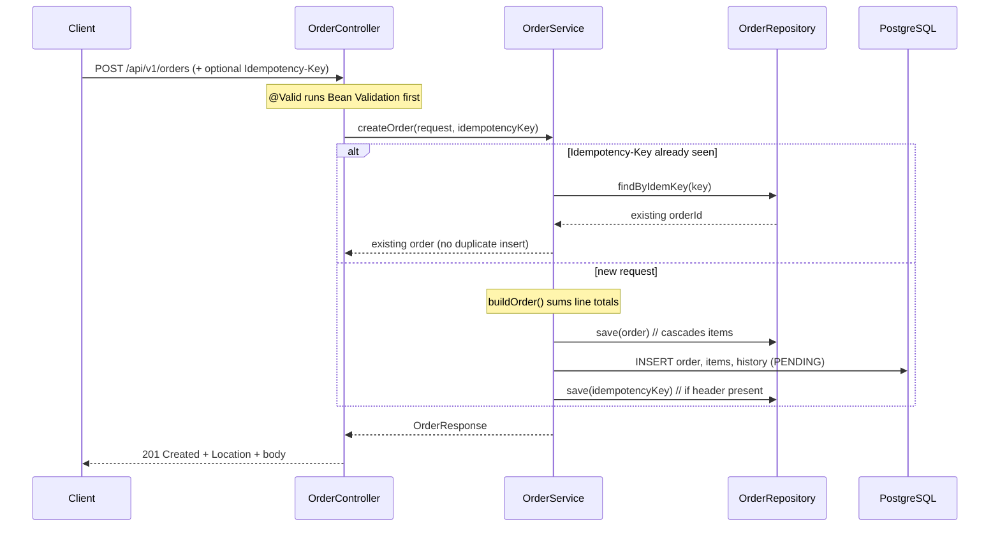

# Create Order

Create a new order together with its line items. The whole write (order + all items + initial history row) commits in **one transaction**, and an optional `Idempotency-Key` header makes retries safe.

| | |
|---|---|
| **Method & path** | `POST /api/v1/orders` |
| **Success** | `201 Created` (with a `Location` header) |
| **Failure** | `400 Bad Request` (validation) |
| **Optional header** | `Idempotency-Key: <any string>` |

---

## 1. Request

### Body

```json
{
  "customerId": "11111111-1111-1111-1111-111111111111",
  "items": [
    { "productId": "22222222-2222-2222-2222-222222222222", "quantity": 2, "unitPrice": "19.99" },
    { "productId": "33333333-3333-3333-3333-333333333333", "quantity": 1, "unitPrice": "5.00" }
  ]
}
```

### Validation rules

The body is a `record` annotated with Bean Validation constraints. The controller's `@Valid` triggers them **before** any business code runs; a violation never reaches the service.

```java
public record CreateOrderRequest(
        @NotNull(message = "customerId is required")
        UUID customerId,

        @NotEmpty(message = "an order must contain at least one item")
        @Valid                                  // cascade validation into each item
        List<CreateOrderItemRequest> items
) {}

public record CreateOrderItemRequest(
        @NotNull(message = "productId is required")
        UUID productId,

        @NotNull(message = "quantity is required")
        @Positive(message = "quantity must be greater than 0")
        Integer quantity,

        @NotNull(message = "unitPrice is required")
        @DecimalMin(value = "0.00", message = "unitPrice must not be negative")
        @Digits(integer = 10, fraction = 2, message = "unitPrice must have at most 2 decimal places")
        BigDecimal unitPrice
) {}
```

| Field | Rule |
|---|---|
| `customerId` | required, UUID |
| `items` | required, **at least one** |
| `items[].productId` | required, UUID |
| `items[].quantity` | required, **> 0** |
| `items[].unitPrice` | required, ≥ 0, max 2 decimals |

---

## 2. End-to-end flow



### Step 1 — Controller (thin: validate + delegate)

```java
@PostMapping
@Operation(summary = "Create an order with one or more items")
public ResponseEntity<OrderResponse> create(
        @Valid @RequestBody CreateOrderRequest request,
        @RequestHeader(value = "Idempotency-Key", required = false) String idempotencyKey,
        UriComponentsBuilder uriBuilder) {
    OrderResponse created = orderService.createOrder(request, idempotencyKey);
    URI location = uriBuilder.path("/api/v1/orders/{id}").buildAndExpand(created.id()).toUri();
    return ResponseEntity.created(location).body(created);   // 201 + Location header
}
```

The controller does three things only: let `@Valid` reject bad input, call the service, and build a RESTful `201 Created` with a `Location` header pointing at the new resource.

### Step 2 — Service (business logic, one transaction)

```java
@Transactional
public OrderResponse createOrder(CreateOrderRequest request, String idempotencyKey) {
    boolean hasKey = StringUtils.hasText(idempotencyKey);
    if (hasKey) {
        Optional<IdempotencyKey> existing = idempotencyKeyRepository.findByIdemKey(idempotencyKey);
        if (existing.isPresent()) {
            return detailById(existing.get().getOrderId());   // retry → return original order
        }
    }

    Order order = buildOrder(request);

    try {
        orderRepository.save(order);                          // cascades to order_items
        recordHistory(order.getId(), null, OrderStatus.PENDING);
        if (hasKey) {
            idempotencyKeyRepository.save(new IdempotencyKey(UUID.randomUUID(), idempotencyKey, order.getId()));
        }
    } catch (DataIntegrityViolationException e) {
        // Concurrent request won the race on the same idempotency key (UNIQUE constraint).
        if (hasKey) {
            return idempotencyKeyRepository.findByIdemKey(idempotencyKey)
                    .map(k -> detailById(k.getOrderId()))
                    .orElseThrow(() -> e);
        }
        throw e;
    }

    return detailById(order.getId());
}
```

Everything inside `@Transactional` either commits together or rolls back together — you never get an order with no items, or an order without its initial history row.

### Step 3 — Building the order (total is computed server-side)

The `total_amount` is **never trusted from the client**; the service derives it from `quantity × unitPrice` across the items:

```java
private Order buildOrder(CreateOrderRequest request) {
    BigDecimal total = request.items().stream()
            .map(i -> i.unitPrice().multiply(BigDecimal.valueOf(i.quantity())))
            .reduce(BigDecimal.ZERO, BigDecimal::add);
    Order order = new Order(UUID.randomUUID(), request.customerId(), OrderStatus.PENDING, total);
    for (var itemReq : request.items()) {
        order.addItem(new OrderItem(UUID.randomUUID(), itemReq.productId(), itemReq.quantity(), itemReq.unitPrice()));
    }
    return order;
}
```

New orders always start in `PENDING`. IDs are server-generated UUIDs.

### Step 4 — Persistence (cascade + history)

`order.addItem(...)` wires the bidirectional relationship, and the `Order` entity cascades the insert to its items:

```java
@OneToMany(mappedBy = "order", cascade = CascadeType.ALL, orphanRemoval = true, fetch = FetchType.LAZY)
private List<OrderItem> items = new ArrayList<>();
```

So a single `orderRepository.save(order)` writes the `orders` row **and** every `order_items` row. `recordHistory(id, null, PENDING)` then appends the first `order_status_history` row (`from = null → to = PENDING`), giving the order an audit trail from birth.

### Step 5 — Idempotent create (why retries are safe)

If the client sends an `Idempotency-Key`:
- **First call** stores `(idem_key → order_id)` in `idempotency_keys` (which has a `UNIQUE` constraint on `idem_key`).
- **Retry / double-click** finds the existing key and returns the original order — no duplicate insert.
- **Two simultaneous calls** with the same key: one wins the `UNIQUE` constraint; the loser catches `DataIntegrityViolationException` and returns the winner's order. The database is the arbiter, not application logic.

### Step 6 — Mapping back to a DTO (entities never leak)

```java
private OrderResponse detailById(UUID id) {
    Order order = orderRepository.findByIdWithItems(id).orElseThrow(() -> new OrderNotFoundException(id));
    List<OrderStatusHistory> history = historyRepository.findByOrderIdOrderByChangedAtAsc(id);
    return OrderResponse.detail(order, history);   // full projection: order + items + history
}
```

---

## 3. Responses

### `201 Created`

```json
{
  "id": "48a214d9-1045-4b27-84ca-5501de5e2aab",
  "customerId": "11111111-1111-1111-1111-111111111111",
  "status": "PENDING",
  "totalAmount": 44.98,
  "createdAt": "2026-06-19T04:04:40.370795Z",
  "updatedAt": "2026-06-19T04:04:40.370855Z",
  "items": [
    { "id": "f058d4eb-...", "productId": "22222222-...", "quantity": 2, "unitPrice": 19.99, "lineTotal": 39.98 },
    { "id": "00bda5dc-...", "productId": "33333333-...", "quantity": 1, "unitPrice": 5.00,  "lineTotal": 5.00 }
  ],
  "history": [
    { "fromStatus": null, "toStatus": "PENDING", "changedAt": "2026-06-19T04:04:40.376726Z" }
  ]
}
```

`Location: /api/v1/orders/48a214d9-1045-4b27-84ca-5501de5e2aab`

### `400 Bad Request` (validation)

Produced by the global handler (`@RestControllerAdvice`), with per-field detail:

```json
{
  "timestamp": "2026-06-19T04:04:40.431Z",
  "status": 400,
  "error": "Bad Request",
  "message": "Validation failed",
  "path": "/api/v1/orders",
  "fieldErrors": [
    { "field": "items", "message": "an order must contain at least one item" }
  ]
}
```

---

## 4. Try it (curl)

```bash
# Happy path
curl -i -X POST http://localhost:8080/api/v1/orders \
  -H 'Content-Type: application/json' \
  -d '{
    "customerId": "11111111-1111-1111-1111-111111111111",
    "items": [
      {"productId": "22222222-2222-2222-2222-222222222222", "quantity": 2, "unitPrice": "19.99"},
      {"productId": "33333333-3333-3333-3333-333333333333", "quantity": 1, "unitPrice": "5.00"}
    ]
  }'

# Idempotent retry — run twice with the same key, get the same order id both times
KEY=$(uuidgen)
curl -s -X POST http://localhost:8080/api/v1/orders -H "Idempotency-Key: $KEY" \
  -H 'Content-Type: application/json' \
  -d '{"customerId":"11111111-1111-1111-1111-111111111111","items":[{"productId":"22222222-2222-2222-2222-222222222222","quantity":1,"unitPrice":"1.00"}]}'

# Validation failure (empty items) → 400
curl -i -X POST http://localhost:8080/api/v1/orders \
  -H 'Content-Type: application/json' \
  -d '{"customerId":"11111111-1111-1111-1111-111111111111","items":[]}'
```

---

## 5. Tests that cover this

- `OrderApiIntegrationTest.createPersistsOrderWithItemsAndComputedTotal` — 201, items persisted, `totalAmount` computed, one history row.
- `OrderApiIntegrationTest.validationRejectsEmptyItemsAndNonPositiveQuantity` — empty items and `quantity = 0` both yield 400.
- `OrderApiIntegrationTest.idempotencyKeyReturnsSameOrderOnRetry` — same key twice returns the same order id.

---

| ⏮ Prev | Index | Next ⏭ |
|---|---|---|
| — | [API docs](./README.md) | [Get Order](./02-get-order.md) |
