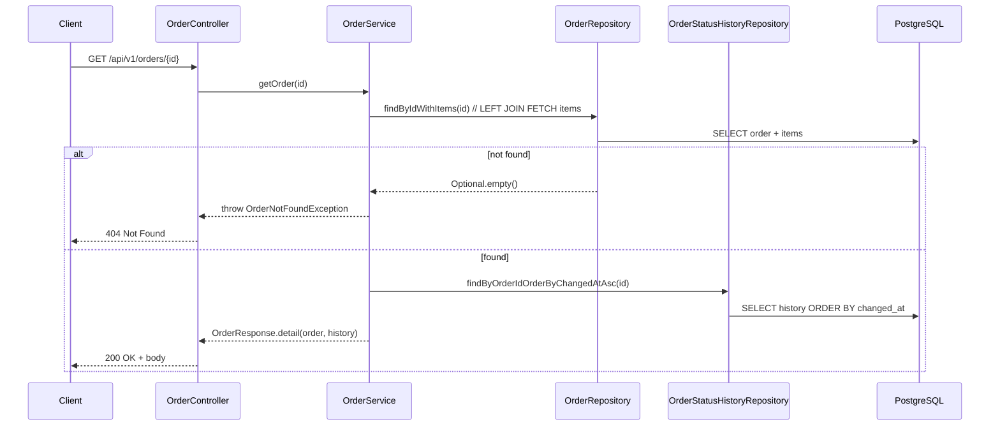

# Get Order

Retrieve a single order by id, including **all its items and its full status history**. This is the detailed projection — the one-stop view for tracking an order.

| | |
|---|---|
| **Method & path** | `GET /api/v1/orders/{id}` |
| **Success** | `200 OK` |
| **Failure** | `404 Not Found` |

---

## 1. Request

- **Path variable:** `id` — the order's UUID.
- No body, no query parameters.

If `id` isn't a valid UUID, Spring rejects it before the controller body runs and the global handler returns `400` (via `MethodArgumentTypeMismatchException`).

---

## 2. End-to-end flow



### Step 1 — Controller

```java
@GetMapping("/{id}")
@Operation(summary = "Retrieve an order with its items and status history")
public OrderResponse get(@PathVariable UUID id) {
    return orderService.getOrder(id);
}
```

Returning the DTO directly yields `200 OK`. No `ResponseEntity` needed.

### Step 2 — Service (read-only transaction)

```java
@Transactional(readOnly = true)
public OrderResponse getOrder(UUID id) {
    return detailById(id);
}
```

`readOnly = true` is a hint to the JDBC driver/Hibernate that no writes will happen — it skips dirty-checking and can use a read-only connection.

### Step 3 — Loading order + items in one query (avoids N+1)

```java
@Query("SELECT o FROM Order o LEFT JOIN FETCH o.items WHERE o.id = :id")
Optional<Order> findByIdWithItems(@Param("id") UUID id);
```

The `LEFT JOIN FETCH` pulls the order and all its items in a **single** SQL statement instead of one query for the order plus one-per-item (the classic N+1 problem). `LEFT` (not inner) join means an order with zero items would still be returned.

### Step 4 — Loading history, then mapping

```java
private OrderResponse detailById(UUID id) {
    Order order = orderRepository.findByIdWithItems(id).orElseThrow(() -> new OrderNotFoundException(id));
    List<OrderStatusHistory> history = historyRepository.findByOrderIdOrderByChangedAtAsc(id);
    return OrderResponse.detail(order, history);
}
```

History is a separate, ordered query (chronological). The `detail(...)` factory builds the full DTO — order fields + mapped items + mapped history:

```java
public static OrderResponse detail(Order order, List<OrderStatusHistory> history) {
    return new OrderResponse(
            order.getId(), order.getCustomerId(), order.getStatus().name(), order.getTotalAmount(),
            order.getCreatedAt(), order.getUpdatedAt(),
            order.getItems().stream().map(OrderItemResponse::from).toList(),
            history.stream().map(OrderStatusHistoryResponse::from).toList()
    );
}
```

### Step 5 — The 404 path

`orElseThrow(() -> new OrderNotFoundException(id))` throws a domain exception, which the global handler turns into a clean `404`:

```java
@ExceptionHandler(OrderNotFoundException.class)
public ResponseEntity<ErrorResponse> handleNotFound(OrderNotFoundException ex, HttpServletRequest req) {
    return build(HttpStatus.NOT_FOUND, ex.getMessage(), req);
}
```

---

## 3. Responses

### `200 OK`

```json
{
  "id": "626d05d7-fdba-4185-9ae1-1cb94127b76a",
  "customerId": "11111111-1111-1111-1111-111111111111",
  "status": "DELIVERED",
  "totalAmount": 44.98,
  "createdAt": "2026-06-19T04:05:02.904282Z",
  "updatedAt": "2026-06-19T04:05:03.008096Z",
  "items": [
    { "id": "81e6d353-...", "productId": "22222222-...", "quantity": 2, "unitPrice": 19.99, "lineTotal": 39.98 },
    { "id": "728161da-...", "productId": "33333333-...", "quantity": 1, "unitPrice": 5.00,  "lineTotal": 5.00 }
  ],
  "history": [
    { "fromStatus": null,         "toStatus": "PENDING",    "changedAt": "2026-06-19T04:05:02.906Z" },
    { "fromStatus": "PENDING",    "toStatus": "PROCESSING", "changedAt": "2026-06-19T04:05:02.937Z" },
    { "fromStatus": "PROCESSING", "toStatus": "SHIPPED",    "changedAt": "2026-06-19T04:05:02.989Z" },
    { "fromStatus": "SHIPPED",    "toStatus": "DELIVERED",  "changedAt": "2026-06-19T04:05:03.007Z" }
  ]
}
```

The `history` array is exactly what makes this a *tracking* endpoint rather than a status snapshot.

### `404 Not Found`

```json
{
  "timestamp": "2026-06-19T04:04:40.417Z",
  "status": 404,
  "error": "Not Found",
  "message": "Order not found: 99999999-9999-9999-9999-999999999999",
  "path": "/api/v1/orders/99999999-9999-9999-9999-999999999999",
  "fieldErrors": null
}
```

---

## 4. Try it (curl)

```bash
# Replace <ID> with an id returned by the create endpoint
curl -s http://localhost:8080/api/v1/orders/<ID>

# Unknown id → 404
curl -i http://localhost:8080/api/v1/orders/99999999-9999-9999-9999-999999999999
```

---

## 5. Tests that cover this

- `OrderApiIntegrationTest.getByIdReturnsOrder_andUnknownReturns404` — 200 with items for a real id; 404 for an unknown id.
- `OrderApiIntegrationTest.updateStatusEnforcesStateMachine` — indirectly asserts the full history accumulates across transitions.

---

| ⏮ Prev | Index | Next ⏭ |
|---|---|---|
| [Create Order](./01-create-order.md) | [API docs](./README.md) | [List Orders](./03-list-orders.md) |
