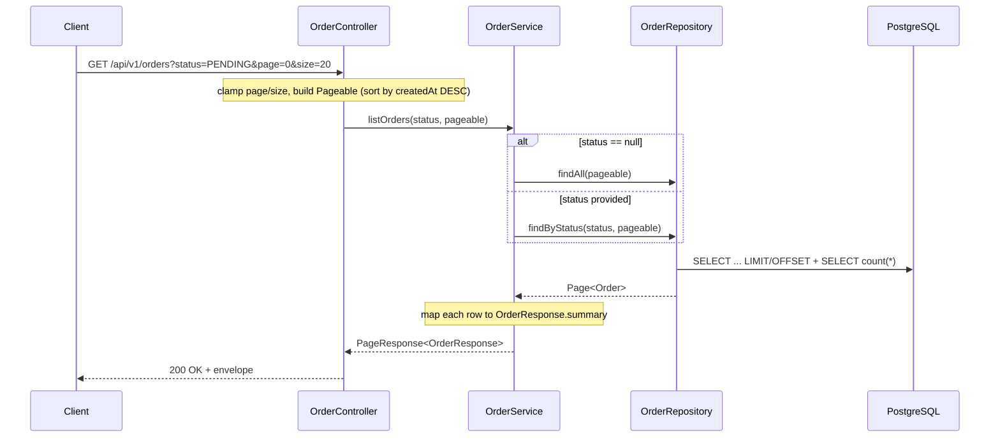

# List Orders

List orders, optionally filtered by status, **always paginated**. Returns a lightweight summary projection (no items/history) so the payload stays small.

| | |
|---|---|
| **Method & path** | `GET /api/v1/orders` |
| **Query params** | `status` (optional), `page` (default `0`), `size` (default `20`, max `100`) |
| **Success** | `200 OK` |

---

## 1. Request

| Param | Type | Default | Notes |
|---|---|---|---|
| `status` | `OrderStatus` | none | One of `PENDING`, `PROCESSING`, `SHIPPED`, `DELIVERED`, `CANCELLED`. Omit for "all". |
| `page` | int | `0` | Zero-based page index; negatives are clamped to `0`. |
| `size` | int | `20` | Page size; clamped to the range `1..100`. |

Results are sorted by `createdAt` **descending** (newest first).

An invalid `status` value (e.g. `?status=NOPE`) is rejected before the body runs and returns `400` via the global handler.

---

## 2. Why paginated (a deliberate choice)

The requirement says "list all orders," but returning an unbounded result set is a classic production foot-gun — it blows up memory and latency once the table grows. So the endpoint paginates with sane defaults and a **hard cap of 100** rows per page. The cap is enforced in the controller, not trusted from the client.

---

## 3. End-to-end flow



### Step 1 — Controller (clamp inputs, build `Pageable`)

```java
private static final int MAX_PAGE_SIZE = 100;

@GetMapping
@Operation(summary = "List orders, optionally filtered by status (paginated)")
public PageResponse<OrderResponse> list(
        @RequestParam(required = false) OrderStatus status,
        @RequestParam(defaultValue = "0") int page,
        @RequestParam(defaultValue = "20") int size) {
    int safeSize = Math.min(Math.max(size, 1), MAX_PAGE_SIZE);   // clamp to 1..100
    int safePage = Math.max(page, 0);                            // no negative pages
    Pageable pageable = PageRequest.of(safePage, safeSize, Sort.by(Sort.Direction.DESC, "createdAt"));
    return orderService.listOrders(status, pageable);
}
```

`status` binds straight to the `OrderStatus` enum — Spring converts the string for you, and an unknown value becomes a `400` automatically.

### Step 2 — Service (filter or not)

```java
@Transactional(readOnly = true)
public PageResponse<OrderResponse> listOrders(OrderStatus status, Pageable pageable) {
    var page = (status == null)
            ? orderRepository.findAll(pageable)
            : orderRepository.findByStatus(status, pageable);
    return PageResponse.from(page, OrderResponse::summary);
}
```

The status filter is a derived Spring Data query — no SQL written by hand:

```java
Page<Order> findByStatus(OrderStatus status, Pageable pageable);
```

This rides the `idx_orders_status` index from the schema, so the filter stays fast as the table grows.

### Step 3 — Summary projection (small payload)

The list returns a **summary** — no items, no history — to keep responses lean:

```java
public static OrderResponse summary(Order order) {
    return new OrderResponse(
            order.getId(), order.getCustomerId(), order.getStatus().name(), order.getTotalAmount(),
            order.getCreatedAt(), order.getUpdatedAt(),
            null,   // items omitted in list view
            null    // history omitted in list view
    );
}
```

### Step 4 — A stable pagination envelope

We don't serialize Spring's `Page` directly (its JSON shape changes between versions). Instead we map to our own record:

```java
public record PageResponse<T>(
        List<T> content, int page, int size, long totalElements, int totalPages
) {
    public static <E, T> PageResponse<T> from(Page<E> page, Function<E, T> mapper) {
        return new PageResponse<>(
                page.getContent().stream().map(mapper).toList(),
                page.getNumber(), page.getSize(), page.getTotalElements(), page.getTotalPages());
    }
}
```

Spring Data runs two queries under the hood: the page slice (`LIMIT`/`OFFSET`) and a `count(*)` to populate `totalElements` / `totalPages`.

---

## 4. Responses

### `200 OK`

```json
{
  "content": [
    {
      "id": "626d05d7-fdba-4185-9ae1-1cb94127b76a",
      "customerId": "11111111-1111-1111-1111-111111111111",
      "status": "PENDING",
      "totalAmount": 44.98,
      "createdAt": "2026-06-19T04:05:02.904282Z",
      "updatedAt": "2026-06-19T04:05:02.904282Z",
      "items": null,
      "history": null
    }
  ],
  "page": 0,
  "size": 20,
  "totalElements": 1,
  "totalPages": 1
}
```

An empty result is a normal `200` with `"content": []` and `"totalElements": 0` (never a 404).

---

## 5. Try it (curl)

```bash
# All orders, first page
curl -s 'http://localhost:8080/api/v1/orders?page=0&size=20'

# Filter by status
curl -s 'http://localhost:8080/api/v1/orders?status=PENDING'

# Small page to see pagination
curl -s 'http://localhost:8080/api/v1/orders?page=0&size=1'

# Oversized size is clamped to 100 server-side
curl -s 'http://localhost:8080/api/v1/orders?size=100000'
```

---

## 6. Tests that cover this

- `OrderApiIntegrationTest.listSupportsStatusFilterAndPagination` — page size honored, status filter returns matching rows, and a status with no rows returns `totalElements = 0`.

---

| ⏮ Prev | Index | Next ⏭ |
|---|---|---|
| [Get Order](./02-get-order.md) | [API docs](./README.md) | [Update Status](./04-update-status.md) |
