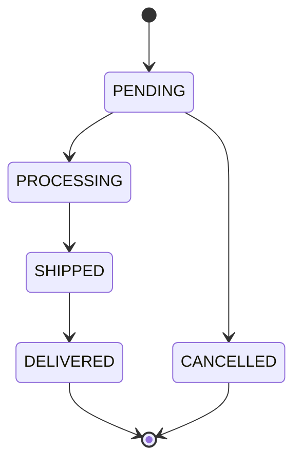

# Update Status

Move an order to a new status. The change is validated against a **central state machine**, so only legal transitions succeed; everything else is a `409 Conflict`.

| | |
|---|---|
| **Method & path** | `PATCH /api/v1/orders/{id}/status` |
| **Success** | `200 OK` |
| **Failure** | `404 Not Found` (unknown id) · `409 Conflict` (illegal transition) |

---

## 1. Request

### Body

```json
{ "status": "PROCESSING" }
```

```java
public record UpdateStatusRequest(
        @NotNull(message = "status is required")
        OrderStatus status
) {}
```

`status` must be a valid `OrderStatus` (`PENDING`, `PROCESSING`, `SHIPPED`, `DELIVERED`, `CANCELLED`). A missing value → `400`; an unknown value → `400` (enum binding failure).

---

## 2. The state machine (the rule lives in one place)



All legal transitions are declared in a single map. Adding a status or an edge is a one-line change — no scattered `if` checks to hunt down.

```java
private static final Map<OrderStatus, Set<OrderStatus>> ALLOWED = Map.of(
        PENDING,    Set.of(PROCESSING, CANCELLED),
        PROCESSING, Set.of(SHIPPED),
        SHIPPED,    Set.of(DELIVERED),
        DELIVERED,  Set.of(),     // terminal
        CANCELLED,  Set.of()      // terminal
);

public boolean canTransition(OrderStatus from, OrderStatus to) {
    return ALLOWED.getOrDefault(from, Set.of()).contains(to);
}

public void assertCanTransition(OrderStatus from, OrderStatus to) {
    if (!canTransition(from, to)) {
        throw new InvalidStatusTransitionException(from, to);   // -> 409
    }
}
```

So you **cannot** skip `PENDING → SHIPPED`, **cannot** move `DELIVERED` backwards, and **cannot** cancel a `SHIPPED` order.

---

## 3. End-to-end flow

```mermaid
sequenceDiagram
    participant Client
    participant Controller as OrderController
    participant Service as OrderService
    participant SM as OrderStateMachine
    participant Repo as OrderRepository
    participant DB as PostgreSQL

    Client->>Controller: PATCH /api/v1/orders/{id}/status {status}
    Controller->>Service: updateStatus(id, target)
    Service->>Repo: findById(id)
    alt not found
        Repo-->>Service: empty → throw OrderNotFoundException
        Service-->>Client: 404
    else found
        Service->>SM: assertCanTransition(current, target)
        alt illegal transition
            SM-->>Service: throw InvalidStatusTransitionException
            Service-->>Client: 409
        else legal
            Note over Service: order.setStatus(target) — dirty-checked
            Service->>Repo: save history row (from → to)
            Service->>DB: UPDATE orders (flush on commit; @Version checked)
            Service-->>Client: 200 OK + updated order
        end
    end
```

### Step 1 — Controller

```java
@PatchMapping("/{id}/status")
@Operation(summary = "Change an order's status (validated against the state machine)")
public OrderResponse updateStatus(@PathVariable UUID id, @Valid @RequestBody UpdateStatusRequest request) {
    return orderService.updateStatus(id, request.status());
}
```

### Step 2 — Service (load → validate → mutate → record)

```java
@Transactional
public OrderResponse updateStatus(UUID id, OrderStatus target) {
    Order order = orderRepository.findById(id).orElseThrow(() -> new OrderNotFoundException(id));
    OrderStatus current = order.getStatus();
    stateMachine.assertCanTransition(current, target);   // throws 409 if illegal
    order.setStatus(target);
    // dirty-checking flushes the UPDATE on commit; @Version guards concurrent writes
    recordHistory(id, current, target);
    return detailById(id);
}
```

Notice there's no explicit `save(order)` — the entity is *managed* inside the transaction, so Hibernate's dirty checking emits the `UPDATE` automatically at commit. `recordHistory(current, target)` appends a new `order_status_history` row capturing the exact transition.

### Step 3 — Optimistic locking is the safety net

The `Order` entity carries a `@Version` column:

```java
@Version
@Column(nullable = false)
private long version;
```

If a concurrent writer (for example the background promotion job) changes this same row between our `findById` and the commit, Hibernate detects the version mismatch and throws `OptimisticLockingFailureException`, which the global handler maps to `409`:

```java
@ExceptionHandler(OptimisticLockingFailureException.class)
public ResponseEntity<ErrorResponse> handleOptimisticLock(OptimisticLockingFailureException ex, HttpServletRequest req) {
    return build(HttpStatus.CONFLICT, "The order was modified concurrently; please retry.", req);
}
```

> **Cancel vs. this endpoint.** Both can move `PENDING → CANCELLED`, but they protect themselves differently. This endpoint uses *load + state-machine check + optimistic version*. The dedicated [cancel endpoint](./05-cancel-order.md) uses a single *atomic conditional UPDATE* because it specifically races the scheduler — see that doc for the full story.

---

## 4. Responses

### `200 OK`
The full updated order (same shape as [Get Order](./02-get-order.md)), now with an extra `history` entry for the transition.

### `409 Conflict` (illegal transition)

```json
{
  "timestamp": "2026-06-19T04:05:02.974Z",
  "status": 409,
  "error": "Conflict",
  "message": "Illegal status transition: PROCESSING -> DELIVERED",
  "path": "/api/v1/orders/626d05d7-.../status",
  "fieldErrors": null
}
```

### `404 Not Found`
Returned when `id` doesn't exist (same shape as the Get Order 404).

---

## 5. Try it (curl)

```bash
# Legal forward path
curl -i -X PATCH http://localhost:8080/api/v1/orders/<ID>/status \
  -H 'Content-Type: application/json' -d '{"status":"PROCESSING"}'
curl -i -X PATCH http://localhost:8080/api/v1/orders/<ID>/status \
  -H 'Content-Type: application/json' -d '{"status":"SHIPPED"}'
curl -i -X PATCH http://localhost:8080/api/v1/orders/<ID>/status \
  -H 'Content-Type: application/json' -d '{"status":"DELIVERED"}'

# Illegal skip (PENDING -> SHIPPED) → 409
curl -i -X PATCH http://localhost:8080/api/v1/orders/<NEW_PENDING_ID>/status \
  -H 'Content-Type: application/json' -d '{"status":"SHIPPED"}'
```

---

## 6. Tests that cover this

- `OrderStateMachineTest` (unit) — every legal transition allowed, every illegal one rejected, terminal states are terminal.
- `OrderApiIntegrationTest.updateStatusEnforcesStateMachine` — full legal path, then a rejected transition off a terminal state → 409.
- `OrderApiIntegrationTest.illegalSkipTransitionConflicts` — `PENDING → SHIPPED` → 409.

---

| ⏮ Prev | Index | Next ⏭ |
|---|---|---|
| [List Orders](./03-list-orders.md) | [API docs](./README.md) | [Cancel Order](./05-cancel-order.md) |
