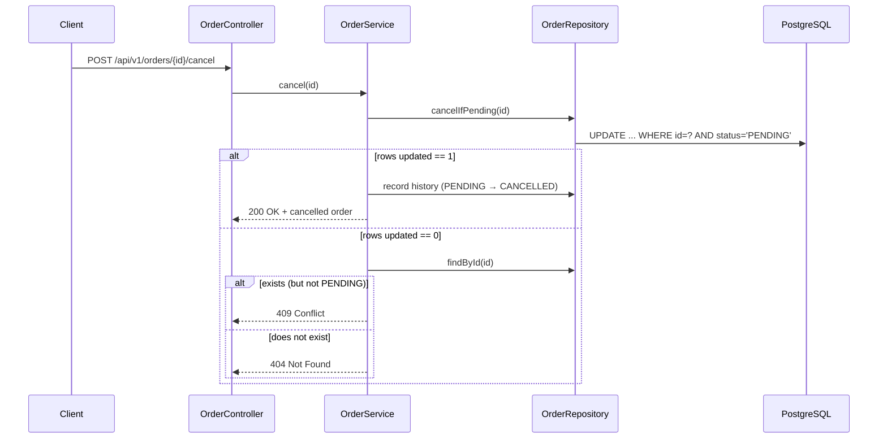

# Cancel Order

Cancel an order. Allowed **only from `PENDING`**. This is the most interesting endpoint in the system because it races a background job — and it's solved with a single **atomic conditional update**.

| | |
|---|---|
| **Method & path** | `POST /api/v1/orders/{id}/cancel` |
| **Success** | `200 OK` (status becomes `CANCELLED`) |
| **Failure** | `404 Not Found` (unknown id) · `409 Conflict` (not cancellable) |

---

## 1. Why `POST /cancel` and not `DELETE`

Cancelling is a **state transition**, not a deletion. The order stays in the database with `status = CANCELLED`, so history, reporting, and audits all survive. Modeling it as a `/cancel` sub-resource makes that intent explicit; a `DELETE` would imply the row disappears.

---

## 2. The problem: cancel vs. the background job

Every 5 minutes a scheduled job promotes pending orders:

```
UPDATE orders SET status = 'PROCESSING' WHERE status = 'PENDING'
```

Now picture a customer hitting **cancel** at the exact instant that job runs. The naive, read-then-write implementation — the one an AI assistant hands you first — is **wrong**:

```java
// WRONG: read-then-write race with the scheduler
Order o = repo.findById(id).orElseThrow();
if (o.getStatus() == PENDING) {
    o.setStatus(CANCELLED);
    repo.save(o);          // the job may have flipped it to PROCESSING in between
}
```

Between the `findById` (reads `PENDING`) and the `save`, the job can promote the row to `PROCESSING`. The save then clobbers it back to `CANCELLED` — a being-processed order silently cancelled. Two writers, last-write-wins, data corruption.

---

## 3. The fix: one atomic conditional UPDATE

Push the check **and** the set into a single SQL statement so the database resolves the race:

```java
@Modifying(clearAutomatically = true, flushAutomatically = true)
@Query("UPDATE Order o SET o.status = com.peerislands.orders.domain.OrderStatus.CANCELLED, " +
       "o.version = o.version + 1 " +
       "WHERE o.id = :id AND o.status = com.peerislands.orders.domain.OrderStatus.PENDING")
int cancelIfPending(@Param("id") UUID id);
```

The `WHERE ... AND status = PENDING` clause is the whole trick:

- It returns **`1`** if the row was still `PENDING` (we cancelled it).
- It returns **`0`** if the row was no longer `PENDING` (already promoted or already cancelled) → we return `409`.

Because the predicate and the update are one statement, the database row lock serializes it against the promotion job. **No explicit locks needed.** Bumping `version` is the optimistic-locking second layer, so any in-flight transaction holding this row also notices the change.

---

## 4. End-to-end flow



### Step 1 — Controller

```java
@PostMapping("/{id}/cancel")
@Operation(summary = "Cancel an order (allowed only from PENDING)")
public OrderResponse cancel(@PathVariable UUID id) {
    return orderService.cancel(id);
}
```

### Step 2 — Service (atomic update, then disambiguate the failure)

```java
@Transactional
public OrderResponse cancel(UUID id) {
    int updated = orderRepository.cancelIfPending(id);
    if (updated == 0) {
        // Distinguish "doesn't exist" (404) from "not cancellable" (409).
        Order order = orderRepository.findById(id).orElseThrow(() -> new OrderNotFoundException(id));
        throw new InvalidStatusTransitionException(
                "Order " + id + " cannot be cancelled from status " + order.getStatus());
    }
    recordHistory(id, OrderStatus.PENDING, OrderStatus.CANCELLED);
    return detailById(id);
}
```

When `cancelIfPending` returns `0`, we do **one** extra read purely to give the client the right error: if the order exists it's a `409` (it was promoted/cancelled); if it doesn't exist it's a `404`.

### Step 3 — Error mapping

```java
@ExceptionHandler(InvalidStatusTransitionException.class)
public ResponseEntity<ErrorResponse> handleInvalidTransition(InvalidStatusTransitionException ex, HttpServletRequest req) {
    return build(HttpStatus.CONFLICT, ex.getMessage(), req);   // 409
}

@ExceptionHandler(OrderNotFoundException.class)
public ResponseEntity<ErrorResponse> handleNotFound(OrderNotFoundException ex, HttpServletRequest req) {
    return build(HttpStatus.NOT_FOUND, ex.getMessage(), req);  // 404
}
```

---

## 5. Responses

### `200 OK`
The full order with `status: "CANCELLED"` and a new `history` entry `PENDING → CANCELLED`.

### `409 Conflict` (not cancellable)

```json
{
  "timestamp": "2026-06-19T04:05:02.961Z",
  "status": 409,
  "error": "Conflict",
  "message": "Order 626d05d7-... cannot be cancelled from status PROCESSING",
  "path": "/api/v1/orders/626d05d7-.../cancel",
  "fieldErrors": null
}
```

### `404 Not Found`
When `id` doesn't exist.

---

## 6. Try it (curl)

```bash
# Cancel a PENDING order → 200, status CANCELLED
curl -i -X POST http://localhost:8080/api/v1/orders/<PENDING_ID>/cancel

# Cancel again, or cancel a PROCESSING/SHIPPED order → 409
curl -i -X POST http://localhost:8080/api/v1/orders/<PENDING_ID>/cancel
```

---

## 7. Tests that cover this

- `OrderApiIntegrationTest.cancelPendingSucceeds_andCancelShippedConflicts` — cancel a `PENDING` order → 200/`CANCELLED`; second cancel → 409; cancel a `SHIPPED` order → 409.
- `CancelVsPromoteConcurrencyTest.cancelAndPromoteRaceLeavesExactlyOneWinner` — fires cancel and the promotion job from two threads on the same order across 40 iterations and asserts **exactly one wins** and the row is never corrupted. This test **fails** against the read-then-write version in §2 — which is precisely why it exists.

```java
// the heart of the concurrency test
if (cancelWon.get()) {
    assertThat(finalStatus).isEqualTo(OrderStatus.CANCELLED);
} else {
    assertThat(finalStatus).isEqualTo(OrderStatus.PROCESSING);
}
```

---

## 8. Production note

Running the promotion `@Scheduled` job on **two** app instances would fire it twice per tick. The fix is **ShedLock** (a distributed lock backed by Postgres/Redis) so exactly one instance runs each tick. It's named in the README but not wired, since the submission runs a single instance — the cancel correctness above does not depend on it.

---

| ⏮ Prev | Index | Next ⏭ |
|---|---|---|
| [Update Status](./04-update-status.md) | [API docs](./README.md) | — |
