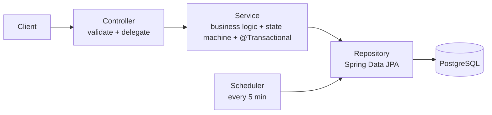

# API documentation

End-to-end walkthroughs of each endpoint — the request, the validation, the full
controller → service → repository → database flow (with the actual code), the
responses, and the tests that cover it.

| # | Endpoint | Method & path | Doc |
|---|---|---|---|
| 1 | Create order | `POST /api/v1/orders` | [01-create-order.md](./01-create-order.md) |
| 2 | Get order | `GET /api/v1/orders/{id}` | [02-get-order.md](./02-get-order.md) |
| 3 | List orders | `GET /api/v1/orders` | [03-list-orders.md](./03-list-orders.md) |
| 4 | Update status | `PATCH /api/v1/orders/{id}/status` | [04-update-status.md](./04-update-status.md) |
| 5 | Cancel order | `POST /api/v1/orders/{id}/cancel` | [05-cancel-order.md](./05-cancel-order.md) |

## How the layers fit together

Every endpoint follows the same shape — a thin controller, all business rules in
the service, parameterized data access in the repository, and DTO **records** on
the way out so JPA entities never leak.

## Cross-cutting concerns referenced throughout

- **Validation** — Bean Validation on the request records, triggered by `@Valid`; failures become a structured `400`.
- **Error handling** — one global `@RestControllerAdvice` maps exceptions to a single error shape: `400` validation, `404` not found, `409` illegal transition / conflict.
- **State machine** — legal status transitions live in one map; see [Update Status](./04-update-status.md).
- **Concurrency** — the cancel-vs-scheduler race and its atomic conditional update; see [Cancel Order](./05-cancel-order.md).

## Interactive docs

When the app is running, the same API is browsable live:

- Swagger UI — http://localhost:8080/swagger-ui.html
- OpenAPI JSON — http://localhost:8080/v3/api-docs

See the [project README](../../README.md) for how to run and test.
