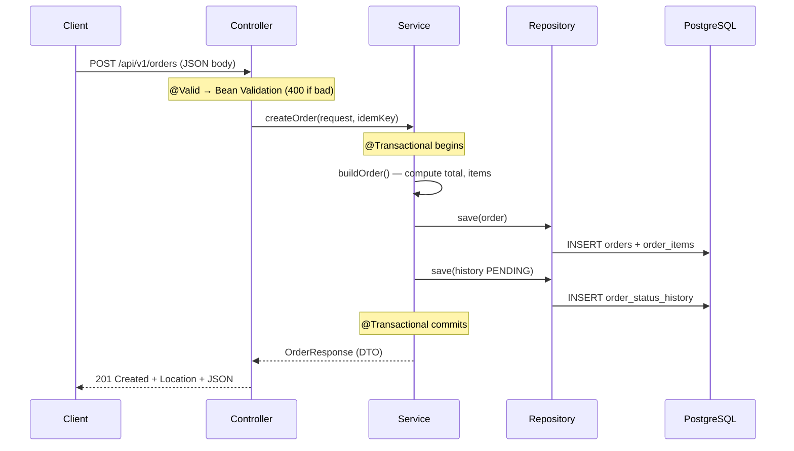

# 01 — Architecture & request flow

## The concept: layered architecture

A **layered architecture** splits the application into horizontal layers where each layer has exactly one responsibility and only talks to the layer directly below it. In a typical Spring backend there are three:

```
        HTTP request
            │
   ┌────────▼─────────┐
   │   Controller     │  "web layer"   — speak HTTP, validate input, no business rules
   └────────┬─────────┘
   ┌────────▼─────────┐
   │    Service       │  "business layer" — rules, transactions, orchestration
   └────────┬─────────┘
   ┌────────▼─────────┐
   │   Repository     │  "persistence layer" — talk to the database
   └────────┬─────────┘
   ┌────────▼─────────┐
   │   PostgreSQL     │
   └──────────────────┘
```

### Why bother? (this is the interview question)

1. **Separation of concerns.** The controller doesn't know SQL; the service doesn't know HTTP; the repository doesn't know business rules. Each can change independently.
2. **Testability.** Business logic in the service can be tested without a web server. The state machine is a plain object you can unit-test in microseconds.
3. **One place per kind of change.** A new validation rule → controller/DTO. A new business rule → service. A new query → repository. You never hunt across the codebase.
4. **It's the structure the interviewer will navigate.** When they say "show me where X happens," a clean layering means you point to one file instantly.

The deliberate choice here is a **monolith**, not microservices — one deployable unit, one database. For five operations and one scheduled job, microservices would be pure overhead (network calls, distributed transactions, more ops). Knowing *when not to* split is senior judgment.

## The package structure maps 1:1 to the layers

```
com.peerislands.orders
├── controller   REST endpoints (thin: validate + delegate)
├── service      business logic, state machine, @Transactional
├── repository   Spring Data JPA interfaces
├── domain       entities + OrderStatus enum
├── dto          request/response records
├── exception    custom exceptions + @RestControllerAdvice
├── scheduler    the background job
└── config       OpenAPI config
```

A reviewer can guess where any piece of code lives without being told. That predictability is the whole point.

---

## End-to-end: what happens on `POST /api/v1/orders`

Let's trace one request from the wire to the database and back. This is the single most likely "walk me through your code" prompt.

### Step 1 — The controller receives and validates

```java
@PostMapping
public ResponseEntity<OrderResponse> create(
        @Valid @RequestBody CreateOrderRequest request,
        @RequestHeader(value = "Idempotency-Key", required = false) String idempotencyKey,
        UriComponentsBuilder uriBuilder) {
    OrderResponse created = orderService.createOrder(request, idempotencyKey);
    URI location = uriBuilder.path("/api/v1/orders/{id}").buildAndExpand(created.id()).toUri();
    return ResponseEntity.created(location).body(created);
}
```

What happens here, in order:

1. Spring deserializes the JSON body into a `CreateOrderRequest` record (using Jackson).
2. `@Valid` runs **Bean Validation** on that record *before your method body executes*. If `items` is empty or a `quantity` is 0, the method is never entered — Spring throws `MethodArgumentNotValidException`, which the global handler turns into a `400`. (See [08 — validation](./08-validation-and-error-handling.md).)
3. The optional `Idempotency-Key` header is read (may be `null`).
4. The controller **delegates** to the service. It contains no business logic — that's the rule for a thin controller.
5. On success it returns `201 Created` with a `Location` header pointing at the new resource — the RESTful way to answer a create.

### Step 2 — The service runs the business logic in a transaction

```java
@Transactional
public OrderResponse createOrder(CreateOrderRequest request, String idempotencyKey) {
    boolean hasKey = StringUtils.hasText(idempotencyKey);
    if (hasKey) {
        Optional<IdempotencyKey> existing = idempotencyKeyRepository.findByIdemKey(idempotencyKey);
        if (existing.isPresent()) {
            return detailById(existing.get().getOrderId());   // retry → return original order
        }
    }

    Order order = buildOrder(request);

    try {
        orderRepository.save(order);                          // INSERT order + cascade items
        recordHistory(order.getId(), null, OrderStatus.PENDING);
        if (hasKey) {
            idempotencyKeyRepository.save(new IdempotencyKey(UUID.randomUUID(), idempotencyKey, order.getId()));
        }
    } catch (DataIntegrityViolationException e) {
        if (hasKey) {                                         // lost a concurrent race on the key
            return idempotencyKeyRepository.findByIdemKey(idempotencyKey)
                    .map(k -> detailById(k.getOrderId()))
                    .orElseThrow(() -> e);
        }
        throw e;
    }

    return detailById(order.getId());
}
```

Key things to say about this method:

- `@Transactional` means **everything inside is one database transaction**: the order, its items, and the first history row either all commit or all roll back. You can never end up with an order that has no items. (See [05 — transactions](./05-transactions-and-jpa.md).)
- The total is computed **server-side** in `buildOrder` — never trusted from the client.
- The idempotency handling is explained in [07 — idempotency](./07-idempotency.md).

### Step 3 — Building the domain object

```java
private Order buildOrder(CreateOrderRequest request) {
    BigDecimal total = request.items().stream()
            .map(i -> i.unitPrice().multiply(BigDecimal.valueOf(i.quantity())))
            .reduce(BigDecimal.ZERO, BigDecimal::add);
    Order order = new Order(UUID.randomUUID(), request.customerId(), OrderStatus.PENDING, total);
    for (var itemReq : request.items()) {
        order.addItem(new OrderItem(UUID.randomUUID(), itemReq.productId(), itemReq.quantity(), itemReq.unitPrice()));
    }
    return order;
}
```

- IDs are server-generated `UUID`s.
- New orders always start in `PENDING`.
- `BigDecimal` is used for money — never `double` (floating point can't represent `0.10` exactly, which corrupts currency math).

### Step 4 — The repository persists it

```java
public interface OrderRepository extends JpaRepository<Order, UUID> { ... }
```

`orderRepository.save(order)` issues the SQL `INSERT`. Because the `Order` entity declares `cascade = CascadeType.ALL` on its `items`, saving the order also inserts every `OrderItem` in the same transaction — one call, multiple tables.

### Step 5 — Mapping back to a DTO (entities never leak)

```java
private OrderResponse detailById(UUID id) {
    Order order = orderRepository.findByIdWithItems(id).orElseThrow(() -> new OrderNotFoundException(id));
    List<OrderStatusHistory> history = historyRepository.findByOrderIdOrderByChangedAtAsc(id);
    return OrderResponse.detail(order, history);
}
```

The service converts the JPA `Order` entity into an `OrderResponse` **record** before returning. The controller serializes that record to JSON. The client never sees the entity. (Why that matters: [02 — DTO pattern](./02-design-patterns.md#3-dto-data-transfer-object).)

### The round trip, visually



---

## Likely interview questions

**Q: Why three layers? Isn't that over-engineering for five endpoints?**
No — the layers are nearly free here and each has a real job: HTTP concerns, business rules, persistence. They make the code testable and predictable. Over-engineering would be adding *more* layers (CQRS, hexagonal ports/adapters, an extra mapping layer) that don't pull their weight at this size.

**Q: Why is the controller so thin?**
Because HTTP is a delivery mechanism, not where business decisions belong. If I later add a gRPC or messaging entry point, the rules stay in the service and I don't duplicate them. A thin controller is also trivial to reason about.

**Q: Why not return the JPA entity directly?**
Three reasons: (1) it couples my API to my database schema — a column rename becomes a breaking API change; (2) lazy-loaded associations can throw `LazyInitializationException` during serialization; (3) I'd leak internal fields like the optimistic-lock `version`. DTO records give me a stable, intentional API surface.

**Q: Where would you add caching / auth / a new endpoint?**
Caching: around the service read methods. Auth: a filter/interceptor before the controller plus an ownership check in the service. A new endpoint: a method in the controller that delegates to a new service method — the layering tells me exactly where each concern goes.

**Q: Monolith vs microservices — defend it.**
One bounded context (orders), one database, five operations. A monolith deploys as one unit, uses local transactions (no distributed-transaction complexity), and is far easier to operate. If orders later needed to trigger inventory/notifications/fulfillment independently, I'd publish an `OrderPlaced` event via a transactional outbox and split *then* — at a real boundary, not speculatively.
