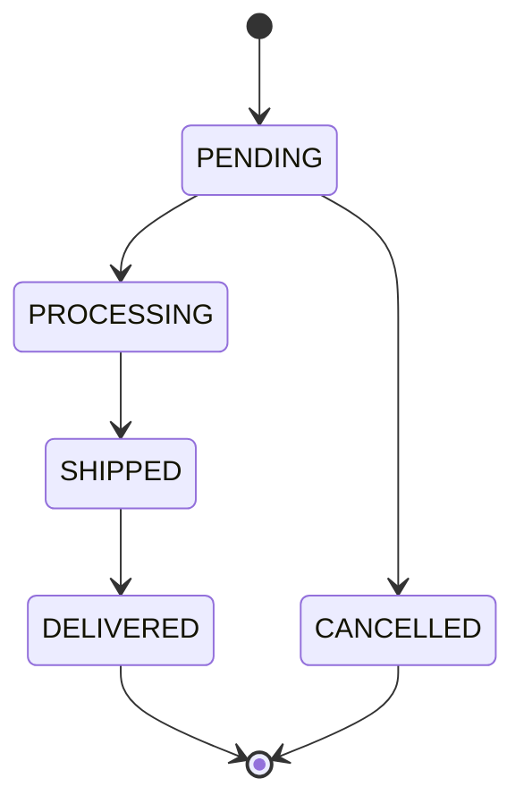

# 03 — The state machine

## The concept: a finite state machine (FSM)

A **finite state machine** is a model with:
- a finite set of **states**,
- a set of allowed **transitions** between them,
- and a rule that **any transition not explicitly allowed is illegal**.

An order's life is exactly this. It isn't a free-form string field that can hold anything — it moves through a defined lifecycle, and some moves make no business sense (you can't ship an order you haven't processed; you can't cancel something already delivered).

### The order lifecycle



In words:
- `PENDING` can go to `PROCESSING` (normal flow) or `CANCELLED` (customer cancels).
- `PROCESSING` can only go to `SHIPPED`.
- `SHIPPED` can only go to `DELIVERED`.
- `DELIVERED` and `CANCELLED` are **terminal** — nothing leaves them.

## Why centralize it (the key design point)

The **junior** version scatters checks across the codebase:

```java
// DON'T: rules spread across controllers/services
if (order.getStatus() == SHIPPED && target == CANCELLED) throw ...;
if (order.getStatus() == DELIVERED) throw ...;
// ...repeated, slightly differently, in three places
```

This rots: someone adds a status and forgets one of the three places, and now the rules disagree. The **senior** version puts the entire rule in **one** data structure:

```java
@Component
public class OrderStateMachine {

    private static final Map<OrderStatus, Set<OrderStatus>> ALLOWED = Map.of(
            PENDING,    Set.of(PROCESSING, CANCELLED),
            PROCESSING, Set.of(SHIPPED),
            SHIPPED,    Set.of(DELIVERED),
            DELIVERED,  Set.of(),      // terminal: no outgoing transitions
            CANCELLED,  Set.of()       // terminal
    );

    public boolean canTransition(OrderStatus from, OrderStatus to) {
        return ALLOWED.getOrDefault(from, Set.of()).contains(to);
    }

    public void assertCanTransition(OrderStatus from, OrderStatus to) {
        if (!canTransition(from, to)) {
            throw new InvalidStatusTransitionException(from, to);   // → HTTP 409
        }
    }
}
```

The whole policy is the `ALLOWED` map. There is exactly one place to read it, change it, and test it.

## How it's used

The service calls `assertCanTransition` before mutating state:

```java
@Transactional
public OrderResponse updateStatus(UUID id, OrderStatus target) {
    Order order = orderRepository.findById(id).orElseThrow(() -> new OrderNotFoundException(id));
    OrderStatus current = order.getStatus();
    stateMachine.assertCanTransition(current, target);   // throws 409 if illegal
    order.setStatus(target);
    recordHistory(id, current, target);                  // audit the transition
    return detailById(id);
}
```

If the transition is illegal, `InvalidStatusTransitionException` is thrown, and the global handler maps it to `409 Conflict` (the right status for "your request conflicts with the current state of the resource").

## Why `409 Conflict` and not `400 Bad Request`?

- `400` means *the request itself is malformed* — bad JSON, missing field, wrong type. The client can fix the request and it'll work.
- `409` means *the request is well-formed but conflicts with the resource's current state*. `PROCESSING → DELIVERED` is a perfectly valid request shape; it's just not allowed *right now* given where the order is. Same request might succeed at a different time/state.

Picking the semantically correct status code is a small thing interviewers notice.

## Note: cancel has its own path

There are *two* ways an order reaches `CANCELLED`:
1. `PATCH /status` with `CANCELLED` → goes through `updateStatus` → state-machine check.
2. `POST /{id}/cancel` → goes through `cancel()`, which uses an **atomic conditional update** instead, because it specifically races the scheduler. See [04 — concurrency](./04-concurrency-and-cancel-race.md).

Both enforce "only from PENDING," but the dedicated cancel endpoint does it at the database level for concurrency safety. Be ready to explain *why the difference exists* — it's a favourite follow-up.

## Worked example

| Current | Requested | `canTransition` | Result |
|---|---|---|---|
| PENDING | PROCESSING | true | 200, status becomes PROCESSING |
| PENDING | SHIPPED | false | 409 (can't skip PROCESSING) |
| PROCESSING | SHIPPED | true | 200 |
| SHIPPED | CANCELLED | false | 409 (too late to cancel) |
| DELIVERED | PROCESSING | false | 409 (terminal, no going back) |
| CANCELLED | PENDING | false | 409 (terminal) |

---

## Extending it live (rehearse this — it's the most likely live task)

### Task: "Add a `RETURNED` status that a `DELIVERED` order can move to."

This is a **one-line-ish** change *by design*. Steps:

**1. Add the enum value** (`OrderStatus.java`):

```java
public enum OrderStatus {
    PENDING, PROCESSING, SHIPPED, DELIVERED, CANCELLED, RETURNED
}
```

**2. Add the transition(s)** in `OrderStateMachine.ALLOWED`:

```java
private static final Map<OrderStatus, Set<OrderStatus>> ALLOWED = Map.of(
        PENDING,    Set.of(PROCESSING, CANCELLED),
        PROCESSING, Set.of(SHIPPED),
        SHIPPED,    Set.of(DELIVERED),
        DELIVERED,  Set.of(RETURNED),   // changed: was Set.of()
        CANCELLED,  Set.of(),
        RETURNED,   Set.of()            // new terminal state
);
```

> Gotcha to mention: `Map.of(...)` supports up to 10 entries. With 6 states you're fine. If you ever exceed 10, switch to `Map.ofEntries(entry(...), ...)`. Knowing that limit off-hand is a nice signal.

**3. That's the behaviour done.** Optionally add a unit test:

```java
@Test
void deliveredCanBeReturned() {
    assertThat(stateMachine.canTransition(DELIVERED, RETURNED)).isTrue();
    assertThat(stateMachine.canTransition(RETURNED, DELIVERED)).isFalse();
}
```

No controller change, no service change, no new `if`. That's the payoff of centralizing: the interviewer asked for a new rule and you touched one map. Say that out loud: *"Because the policy lives in one place, adding a transition is a one-line change and the rest of the system already enforces it."*

### Variant they might ask: "What if a transition needs a side effect (e.g. emit an event on SHIPPED)?"
Then the map alone isn't enough and you'd add a small hook in `updateStatus` after `assertCanTransition` — e.g. publish a domain event. Keep the *legality* in the map and the *side effect* in the service; don't merge the two concerns.

---

## Likely interview questions

**Q: Why a map instead of an enum-with-behaviour or a class per state (GoF State pattern)?**
For 5–6 states with no per-state behaviour beyond "which transitions are legal," a transition map is the simplest correct representation — one place, trivially testable. A class-per-state shines when each state has rich, different behaviour; here that'd be ceremony for no benefit. I can articulate the trade-off, which is the point.

**Q: How do you test it?**
A pure unit test (`OrderStateMachineTest`) with no Spring context: assert every legal transition returns true and every illegal one false. It runs in microseconds because it's just a map lookup. See [09 — testing](./09-testing-strategy.md).

**Q: Where do you enforce it — controller or service?**
Service. The controller shouldn't know business rules. The service is also where the transaction and the history-write happen, so the check belongs next to them.

**Q: What HTTP status for an illegal transition, and why?**
`409 Conflict` — the request is valid but conflicts with the resource's current state, unlike `400` which is for malformed requests.

**Q: A new requirement: orders can be cancelled from PROCESSING too. How hard?**
Add `CANCELLED` to the `PROCESSING` set in the map. But I'd also flag that the dedicated `/cancel` endpoint currently uses `cancelIfPending` (PENDING-only at the DB level), so I'd either generalize that query or route PROCESSING-cancels through `updateStatus`. Spotting that interaction is the senior answer.
